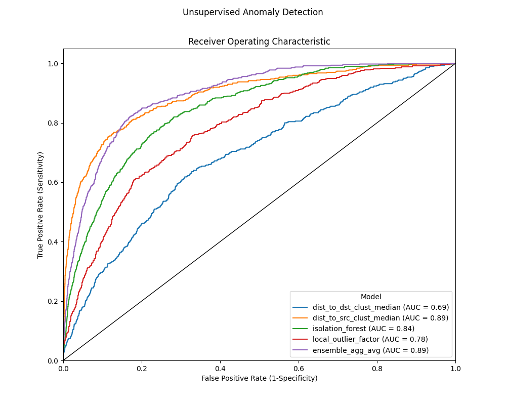

# unsupervised-fraud-detection
Exploring anomaly detection using unsupervised methods



This repo is still massively under construction

Simulate transaction data:
```bash
$ poetry run python -m data.simdata
Simulated dataset written to 'data/input/simdata.csv'
```

Create model training dataset:
```bash
$ poetry run python -m feature_eng.create_train_data
reading input data from 'data/input/simdata.csv'
Finished exporting data to 'feature_eng/output/train_data.csv'
```

Run unsupervised anomaly detection models:
```bash
$ poetry run python -m models.train_predict.dist_to_dst_clust_median
$ poetry run python -m models.train_predict.dist_to_src_clust_median
$ poetry run python -m models.train_predict.local_outlier_factor
$ poetry run python -m models.train_predict.isolation_forest
```

Evaluate models:
```bash
$ poetry run python -m models.evaluate
Exported results to 'models/evaluation_output/'
```

Explain predictions for a specific transaction:
```bash
$ poetry run python -m models.explain_prediction --tid 100420
```
